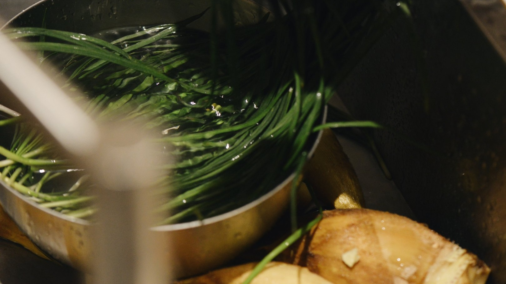
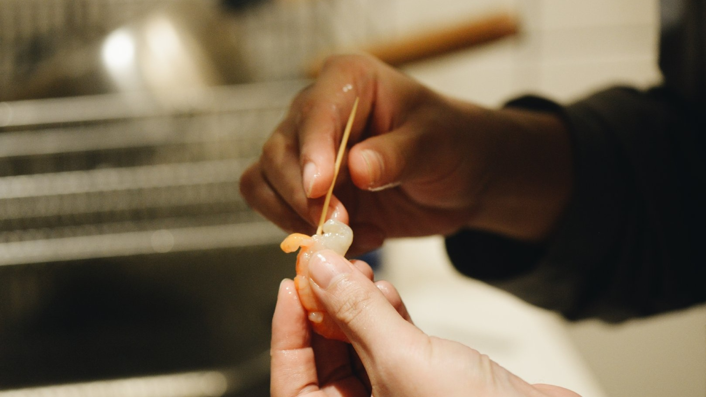
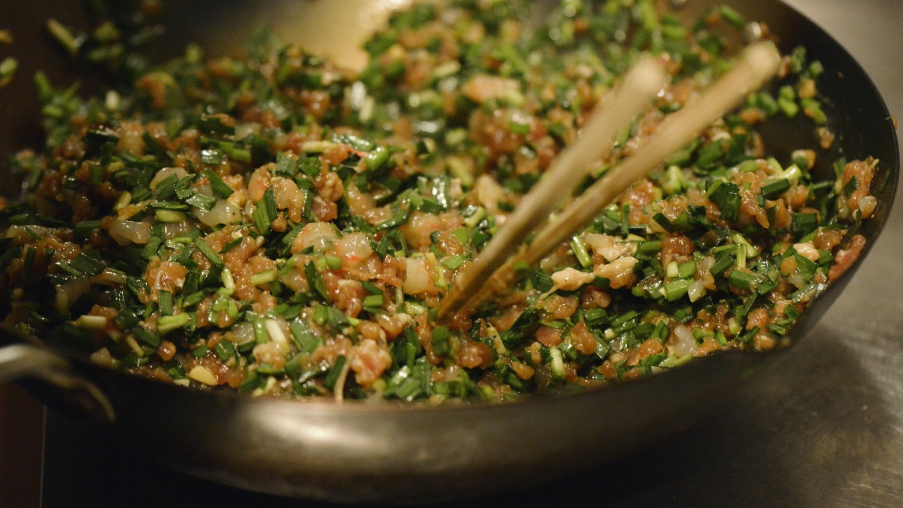
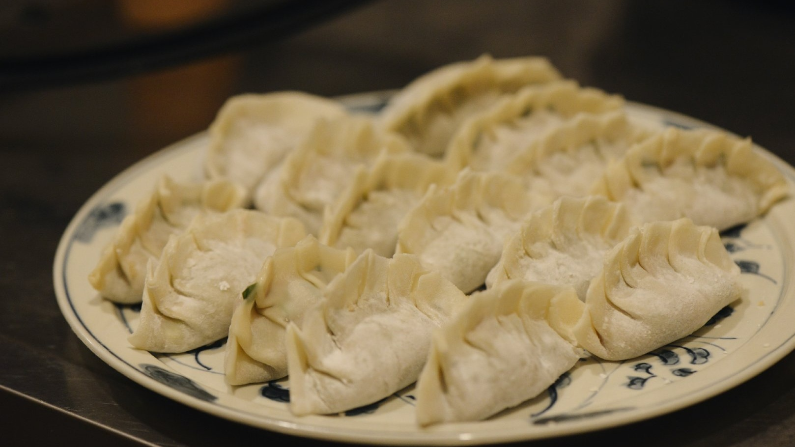
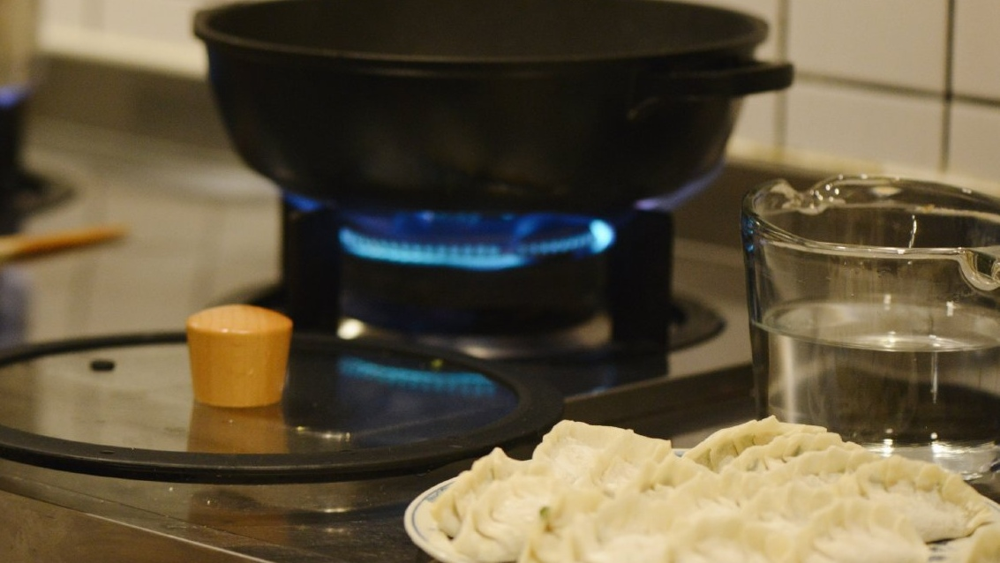
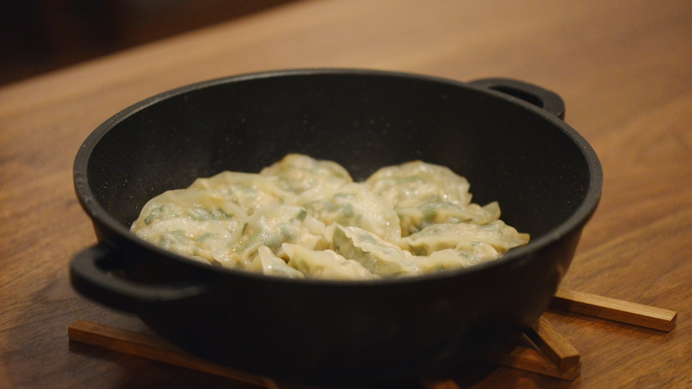
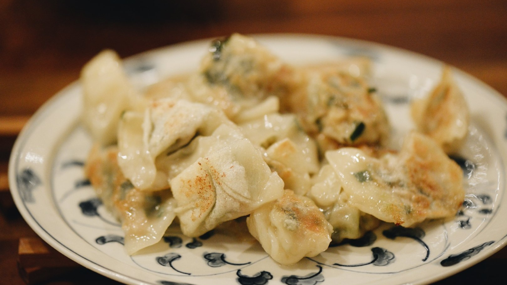

**记录:** **HappyTimes**  

> 孩子喜欢的，妈妈都会懂
> 为孩子认真做菜，不知不觉便以美食为职业
> 再利用互联网平台，把更多温暖分享出去

  

用心洗食材  

  

抽出虾筋  

  

细细的馅料

  

用它包住美味  

  

第一个成品和第二个改良品：）

  

妈妈制作的小可爱们

  

热好一个讲究的锅

  

细火慢煎

  

爱心饺子温暖出锅啦！  
